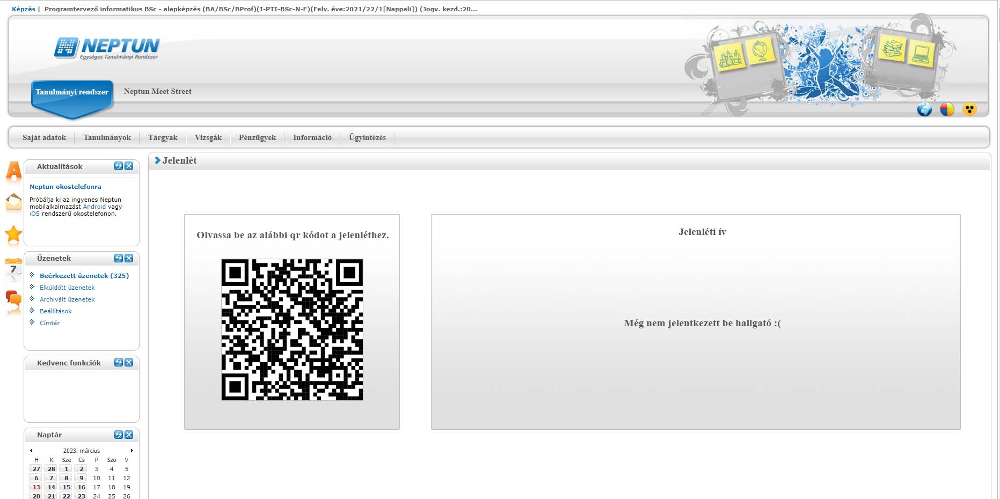

## 1. Áttekintés

A projekt célja egy reszponzív webes alkalmazás amely már egy létező rendszer a "Neptun" másolata, bővített funkciókkal. Ezen funkciók megkönnyíthetik mind a hallgató mind pedig az oktatók munkáját. Átláthatóbb és innovatívabb jelenléti ívet biztosít mely tükrözi a mai gyors világunk pörgését és nem igényel több időt mint 2 perc egy jelenlét felviteléhez a rendszerbe (QR kód). Az jegyátlag mutatása és a jegyek megtekintése funkció további motivációt nyújt a hallgatók számára, mely kutatások alapján javítják az átlagot a hallgatók körében amennyiben szükséges az. Az alkalmazás ingyenes, az adatokat külső adatbázisban tároljuk. 

## 2. Jelenlegi helyzet

A jelenlegi globális felsőoktatási helyzetben nagy prioritású a tanulmányok  monitoringozása. A mi rendszerünk erre ad kimagasló szolgáltatást, mint a jegyek, hiányzások, átlagok nyomonkövetése. Szolgáltatásunk ötvözi az évek óta használt jól bevált "Neptun" webes alkalmazás lehetőségeit, viszont az általunk bevezetett forradalmi innovációk segítségével még tökéletesebb rendszert hozunk létre.

## 3. Követelménylista

- Jelenlét vezetés QR kód beolvasással.
- Hiányzás vezetése, igazolás leadása funkció implementálása.
- Jegyek vezetése, kezelése.
- Jegyátlagok számítása.
- Felhasználókezelés, login rendszer

## 4. Jelenlegi üzleti folyamatok modellje

### 5. Igényelt üzleti folyamatok modellje
- 5.1 Felhasználók jogai
    - 5.1.1 A felhasználó (hallgató) megtekintheti jegyeit
    - 5.1.2 A felhasználó (hallgató) megtekintheti jegyei átlagát
    - 5.1.3 A felhasználó (hallgató) jelezheti órai jelenlétét (QR)
    - 5.1.4 A felhasználó (oktató) megtekintheti az órai hiányzásokat
    - 5.1.5 A felhasználó (oktató) módosíthatja az órai hiányzásokat.
    - 5.1.6 A felhasználó (oktató) megtekintheti a hallgatók jegyeit
    - 5.1.7 A felhasználó (oktató) módosíthatja a hallgatók jegyeit

## 6. Használati esetek

- **Az oldalra látogatva**
    - **Bejelentkezés lehetősége**
- **Bejelentkezés után(hallgató)**
    - **Jegyek, átlagok megtekintése**
    - **Hiányzás megtekintése**
    - **Igazolás leadása**
    - **Kijelentkezés**
- **Bejelentkezés után(oktató)**
    - **Jegyek, átlagok megtekintése, módosítása**
    - **Hiányzás megtekintése, módosítása**
    - **Igazolások megtekintése, eldogadása, elutasítása**
    - **QR kód generálása.**
    - **Kijelentkezés**

## 7. Képernyőterv

## 8. Forgatókönyv

A program nem kíván különösebb telepítési és használati útmutatót. Elég, ha egy grafikus felülettel rendelkező webböngésző fel van telepítve ( alapértelmezett: windows - internet explorer / edge, linux: mozilla, mac - safari ). A felhasználó beüti az oldal címét: xyz.com a böngésző címsorába és rögtön át lesz irányítva az oldalra. Az oldal tartalmát a webszerver szolgáltatja a mögötte lévő adatbázis segítségével. Az oldalra átírányítva a felhasználó megkezdheti a használatát. Ha a felhasználónak bármi nemű problémája akad az oldal működésével kapcsolatban, akkor a megadott elérhetőségek alapján tudja ezt jelezni az oldal karbantartói felé. Az oldal adminisztrátorai moderálják az oldalt a megfelelő eszközök segítségével. Az oldal karbantartásáért felelős csapat pedig az oldal rendeltetésének megfelelő működését ellenőrzi és javítja a felmerülő problémákat.

## 9. Fogalomszótár
   
- **UML** - Unified Modeling Language
- **Reszponzív felület** - Mobilon, Tableten, PC-n igazodik a
képernyőhöz a felület mérete, azaz több eszközön is probléma nélkül
üzemelhet
- **Corrective Maintenance:** A felhasználók által felfedezett és "user reportban"
elküldött hibák kijavítása.
- **Adaptive Maintenance:** A program naprakészen tartása és finomhangolása.
- **Perfective Maintenance:** A szoftver hosszútávú használata érdekében végzett
módosítások, új funkciók, a szoftver teljesítményének és működési
megbízhatóságának javítása.
- **Preventive Maintenance:** Olyan problémák elhárítása, amelyek még nem
tűnnek fontosnak, de később komoly problémákat okozhatnak.  