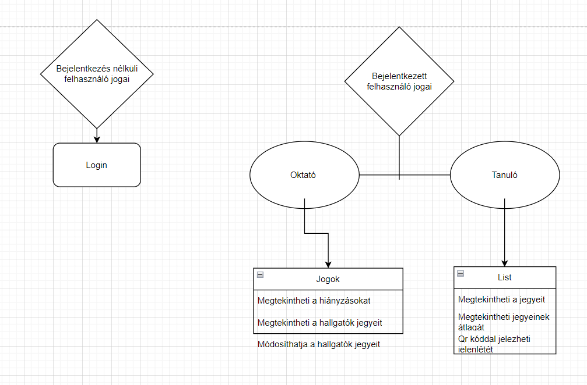

## 1. Áttekintés

A projekt célja egy webes alkalmazás amely egy létező rendszer a "Neptun" másolata, bővített funkciókkal. Az alakalmazás ingyenes, az adatokat külső adatbázisban tároljuk.

## 2. Jelenlegi helyzet

A jelenlegi globális felsőoktatási helyzetben nagy prioritású a tanulmányok  monitoringozása. A mi rendszerünk erre ad kimagasló szolgáltatást, mint a jegyek, hiányzások, átlagok nyomonkövetése. Szolgáltatásunk ötvözi az évek óta használt jól bevált "Neptun" webes alkalmazás lehetőségeit, viszont az általunk bevezetett forradalmi innovációk segítségével még tökéletesebb rendszert hozunk létre.

## 3. Vágyálom rendszer 

A Webalkalmazásunk segítséget fog nyújtani felsőoktatásban résztvevő hallgatóknak jegyeik, jelenlétük, hiányzásuk, átlagaik nyomonkövetésére, forradalmian új eszközeink segítségével. Ezen lehetőségekkel szeretnénk gördülékenyebbé, megbízhatóbbá, átláthatóbbá tenni a jelenlegi, kissé zavaros, hibákkal teli "Neptun" rendszert.

## 4. Funkcionális követelmények

* A felhasználó (hallgató) megtekintheti jegyeit
* A felhasználó (hallgató) jegyei átlagát
* A felhasználó (hallgató) megtekintheti jegyei átlagát
* A felhasználó (hallgató) jelezheti órai jelenlétét (QR)
* A felhasználó (oktató) megtekintheti az órai hiányzásokat
* A felhasználó (oktató) módosíthatja az órai hiányzásokat.
* A felhasználó (oktató) megtekintheti a hallgatók jegyeit
* A felhasználó (oktató) módosíthatja a hallgatók jegyeit
* A felhasználó (oktató) megtakintheti a hallgatók 

## 5. Rendszerre vonatkozó törvények, szabványok, ajánlások

* GDPR-nek való megfelelés
* 451/2016. (XII. 19.) Korm. rendelet az elektronikus ügyintézés részletszabályairól
* 2015. évi CCXXII. törvény az elektronikus ügyintézés és a bizalmi szolgáltatások általános szabályairól
* Ptk. 75. § (3): „A személyhez fűződő jogokat nem sérti az a magatartás, amelyhez a jogosult hozzájárult, feltéve, hogy a hozzájárulás megadása társadalmi érdeket nem sért vagy veszélyeztet. A személyhez fűződő jogokat egyébként korlátozó szerződés vagy egyoldalú nyilatkozat semmis.”

## 6. Jelenlegi üzleti folyamatok modellje

## 7. Igényelt üzleti folyamatok modellje

    5.1 Felhasználók jogai
        5.1.1 A felhasználó (hallgató) megtekintheti jegyeit
        5.1.2 A felhasználó (hallgató) jegyei átlagát
        5.1.3 A felhasználó (hallgató) megtekintheti jegyei átlagát
        5.1.4 A felhasználó (hallgató) jelezheti órai jelenlétét (QR)
        5.1.5 A felhasználó (oktató) megtekintheti az órai hiányzásokat
        5.1.6 A felhasználó (oktató) módosíthatja az órai hiányzásokat.
        5.1.7 A felhasználó (oktató) megtekintheti a hallgatók jegyeit
        5.1.8 A felhasználó (oktató) módosíthatja a hallgatók jegyeit
        5.1.9 A felhasználó (oktató) megtakintheti a hallgatók 

## 8. Követelménylista

* Jelenlét vezetés QR kód beolvasással.
* Hiányzás vezetése, igazolás leadása funkció implementálása.
* Jegyek vezetése, kezelése.
* Jegyátlagok számítása.

## 9. Fogalomtár

* UML - Unified Modeling Language
* Reszponzív felület - Mobilon, Tableten, PC-n igazodik a képernyőhöz a felület mérete, azaz több eszközön is probléma nélkül üzemelhet
* Corrective Maintenance: A felhasználók által felfedezett és "user reportban" elküldött hibák kijavítása.
* Adaptive Maintenance: A program naprakészen tartása és finomhangolása.
* Perfective Maintenance: A szoftver hosszútávú használata érdekében végzett módosítások, új funkciók, a szoftver teljesítményének és   működési megbízhatóságának javítása.
* Preventive Maintenance: Olyan problémák elhárítása, amelyek még nem tűnnek fontosnak, de később komoly problémákat okozhatnak.

