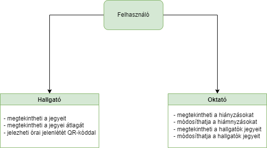

## 1. Rendszer célja

A rendszer elsődleges célja, olyan nyilvántartást segítő alkalmazás fejlesztése, mely a jelenlét és hiányzások követésének megkönnyítésére szolgál. Az alkalmazás használata lehetővé teszi a jelenlét vezetését QR kód beolvasással, hiányzás követését (igazolás leadás), jegyvezetést és átlagszámolást. A QR kódos beolvasás a gyorsabb rögzítést teszi lehetővé. Az alkalmazást PHP programnyelven - Laravel keretrendszerben – lesz elkészítve. 

## 2. Projektterv

### Projektszerepkörök:
  * Termék tulajdonos: Sorsod Borsod csapat
### Projektmunkások és felelősségek:
  * Backend munkálatok: Kiss Barnabás, Zettisch Márk
  * Frontend munkálatok: Szegedi Tamás

### Feladatuk: 
- adatbázis létrehozása az adatok tárolásához
- megfelelő funkciók elkészítése az oldal megfelelő működésének érdekében
- felhasználói felület kialakítása
- tesztelés

### Ütemterv:
|Funkció                  | Feladat                                | Prioritás | Becslés (nap) | Aktuális becslés (nap) | Eltelt idő (nap) | Becsült idő (nap) |
|-------------------------|----------------------------------------|-----------|---------------|------------------------|------------------|---------------------|
|Követelmény specifikáció |Megírás                                 |         1 |             1 |                      1 |                1 |                   1 |             
|Funkcionális specifikáció|Megírás                                 |         1 |             1 |                      1 |                1 |                   1 |
|Rendszerterv             |Megírás                                 |         1 |             1 |                      1 |                1 |                   1 |
|Program                  |Képernyőtervek elkészítése                |         2 |             1 |                      1 |                1 |                   1 |
|Program                  |Prototípus elkészítése	                |         3 |             5 |                      5 |                5 |                   5 |
|Program                  |Alapfunkciók elkészítése                |         3 |             8 |                      8 |                8 |                   8 |
|Program                  |Tesztelés                |         4 |             2 |                      2 |                2 |                   2 |

### 2.4 Mérföldkövek:
   * Dokumentációk
   * Programírás kezdete
   * Program alapvető funkcióinak befejezése
   * Fejlesztés befejezése

## 3. Üzleti folyamatok modellje

## 4. Követelmények

**Funkcionális követelmények**
  - **Felhasználó jelenlét, hiányzások tárolása**
  - **Felhasználók tudják módosítani és törölni a jelenléteket, hiányzásokat**
  - **QR kóddal történő lekérdezések**
  - **Funkciók: átlagszámítás**

  **Nem funkcionális követelmények**

  **Törvényi előírások, szabványok:**
  - **GDPR-nek való megfelelés**

## 5. Funkcionális terv

**Rendszerszereplők:**
  - **Adminisztrátor**
  - **Felhasználó**

  **Rendszerhasználati esetek és lefutásaik:**
  - **Adminisztrátor**
    - **Jegy rögzítés, módosítás, törlés**
    - **Hiányzás rögzítés, módosítás, törlés QR kóddal**
    - **Átlagszámítás jegyek alapján**
  - **Felhasználó**
    - **Megtekintheti a saját jegyeit**
    - **Átlagszámítás saját jegyek alapján**
    - **Saját hiányzások lekérdezése**

  
## 6. Fizikai környezet
- **Az alkalmazás csak web platformra készül, XAMPP segítségével, MySQL adatbázissal lesz futtatva.**
  - **Windows 64 bites operációs rendszeren futtatható.**
  - **Fejlesztői eszközök:**
    - **Visual Studio Code**
    - **Notepad++**
    - **XAMPP**

## 7. Architekturális terv

A rendszer működéséhez szükség van egy adatbázis szerverre, ebben az esetben MySQL-re esett a választás. A Laravel, mint keretrendszer felel a reszponzív webdesign-ért. A backend php alapú.

## 8. Adatbázis terv

### **Táblák**
- **table01:** Hallgatók listája
  - **table02:** Adminisztrátorok listája
  - **table03:** Hiányzások
  - **table04:** Jegyek
  - **table05:** QR kódok

## 9. Implementációs terv

A webes felület HTML, CSS, Javascript és PHP 8.2 nyelven fog elkészülni, Laravel keretrendszer segítségével. Az adatokat MySQL adatbázisban lesznek tárolva, tervek szerint külső helyen.

## 10. Tesztterv
Alapvető funkciók tesztelése Cypress teszteléssel.

## 11. Telepítési terv

A szoftver webes felületéhez csak egy böngésző telepítése szükséges.

**Windows - Microsoft Edge**

**Linux - Mozilla Firefox**

**Mac - Safari**

A weboldalt közvetlenül a böngészőn keresztül elérhetik a kliensek. A weboldal URL címét szükséges ismerni és ezt beírni a böngésző címsorába.

## 12. Karbantartási terv

A kliens felhasználók a weboldalon megadott elérhetőségeken jelenthetik az esetlegesen felmerülő problémákat, hibákat, melyeket fejlesztőink javítanak.

